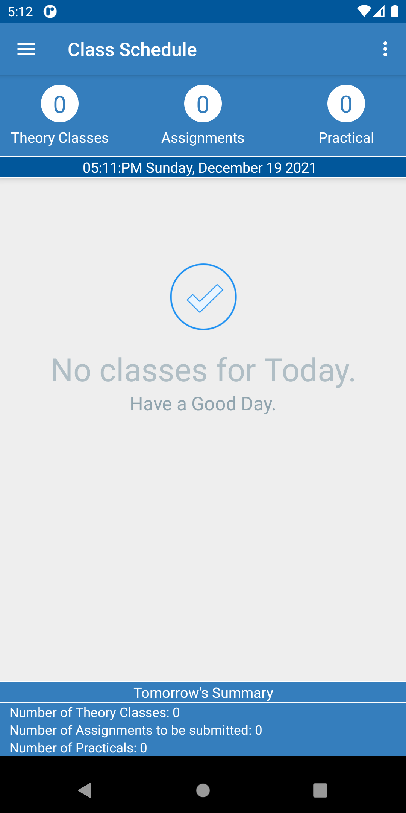

# Class Schedule Android Application
This is the application that I built when I was learning android studio and JAVA in my undergrad. The application
is built to keep track of my class schedule and assignments as I would constantly forget about my class schedule and assignment deadlines.
The app uses sqlite database to store the courses and assignments.
Here are some of the screenshots of the application. This repo includes the source code and released version of the application. The application was built on old android stucio with a target sdk version of 21.
In order to run this code on latest version of android studio migration should be done.
### Home Screen
<pre>
    
</pre>
### Add Subjects
<pre>
    
</pre>
### Others
<pre>
    
</pre>
